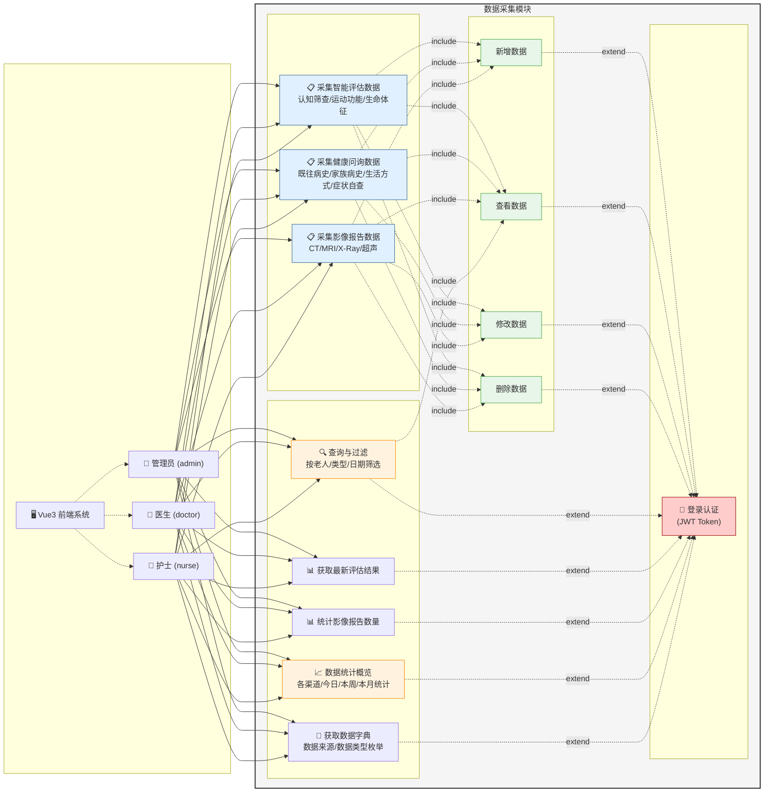

# 数据采集模块 — 需求分析用例图

---

## 参与者说明

| 参与者 | 类型 | 权限范围 |
|--------|------|----------|
| **管理员 (admin)** | 主参与者 | 全部权限：增/删/改/查 + 统计 + 字典 |
| **医生 (doctor)** | 主参与者 | 增/改/查 + 统计 + 字典（部分删除受限） |
| **护士 (nurse)** | 主参与者 | 仅新增 + 查看 + 统计 + 字典 |
| **Vue3 前端系统** | 辅助参与者 | 为各角色提供 UI 界面，转发请求 |
| **JWT 认证服务** | 辅助参与者 | Token 签发与校验，所有接口的前置条件 |

## 用例说明

| 用例 | 说明 |
|------|------|
| 采集智能评估数据 | 采集三类评估（认知筛查、运动功能、生命体征），含评估项、总分、等级、建议 |
| 采集健康问询数据 | 采集四类问询（既往病史、家族病史、生活方式、症状自查），含问答 JSON、风险分析 |
| 采集影像报告数据 | 采集五类影像（CT/MRI/X-Ray/超声/其他），含影像 URL、诊断结果、异常指标 |
| 查询与过滤 | 按老人 ID、数据来源、数据类型、日期范围、采集人组合筛选 |
| 获取最新评估 | 按老人 ID + 评估类型获取最新一条评估记录 |
| 统计影像报告数 | 按老人 ID 统计该老人的影像报告数量 |
| 数据统计概览 | 返回各渠道总量、今日/本周/本月新增量 |
| 获取数据字典 | 暴露 DataSourceEnum / DataTypeEnum 枚举值供前端下拉菜单使用 |

## 关系说明

| 关系 | 含义 |
|------|------|
| **关联** (实线) | 参与者与用例之间存在交互 |
| **include** (虚线箭头 `<<include>>`) | 复合用例必然调用子用例，表示功能复用 |
| **extend** (虚线箭头 `<<extend>>`) | 在特定条件下（此处为已登录）扩展基础用例行为 |

> 注：Mermaid `graph TB` 模式对用例图样式的支持有限，图中用 `include`/`extend` 标注关系。如需要标准 UML 用例图渲染，可将此图导出到 PlantUML 或 draw.io 中重绘。
